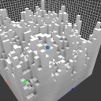
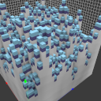
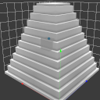

# Scripting api

There is a console command (called `xs`) in voxedit to execute lua scripts for generating voxels. This command expects the lua script filename (`.lua` can be omitted) and the additional arguments for the `main()` method.

Calling `xs <script> help` will print the supported arguments for the given script.

There are two functions in each script. One is called `arguments` and one `main`. `arguments` returns a list of parameters for the `main` function. The default parameters for `main` are `volume`, `region` and `color`. `color` is the palette index starting from `0`.

# Example without parameters

```lua
function main(volume, region, color)
	local mins = region:mins()
	local maxs = region:maxs()
	for x = mins.x, maxs.x do
		for y = mins.y, maxs.y do
			for z = mins.z, maxs.z do
				volume:setVoxel(x, y, z, color)
			end
		end
	end
end
```

Execute this via console `xs scriptfile`

# Example with one parameter

```lua
function arguments()
	return {
		{ name = 'n', desc = 'height level delta', type = 'int', default = '2' }
	}
end

function main(volume, region, color, n)
	[...]
end
```

Execute this via console `xs scriptfile 1` where `1` will be the value of `n`. Omitting the `1` will add the `default` value from the argument list.

# Color

`palette` has several methods to work with colors. E.g. to find a closest possible match for the given palette index.

The functions are:

* `color(paletteIndex)`: Pushes the vec4 of the color behind the palette index (`0-255`) as float values between `0.0` and `1.0`.

* `colors()`: Returns the palette RGBA colors as vec4 values.

* `match(r, g, b)`: Returns the closest possible palette color match for the given RGB (`0-255`) color. The returned palette index is in the range `0-255`. This value can then be used for the `setVoxel` method.

# Region

* `mins()`: The lower boundary of the region (inclusive).

* `maxs()`: The upper boundary of the region (inclusive).

* `x()`: The lower x boundary of the region.

* `y()`: The lower y boundary of the region.

* `z()`: The lower z bounary of the region.

* `width()`: The width of the region measured in voxels.

* `height()`: The height of the region measured in voxels.

* `depth()`: The depth of the region measured in voxels.

# Volume

* `voxel(x, y, z)`: Returns the palette index of the voxel at the given position in the volume `[0-255]`. Or `-1` if there is no voxel.

* `region()`: Return the region of the volume.

* `setVoxel(x, y, z, color)`: Set the given color at the given coordinates in the volume. `color` must be in the range `[0-255]`.

# Other

* `y` going upwards.

You have access to the `cvar` and `cmd` lua bindings, too. This means that you can access any `cvar` value or execute any command like `layeradd` or `layermerge` to modify the whole scene.

```lua
cmd.execute("echo test")
var.int("cl_gamma")
```

To get a full list of commands and cvars use the console command `cmdlist` and `cvarlist`.

# Available scripts

## noise.lua

Generates perlin noise with the frequency and amplitude as parameters with the current selected color.



`xs noise.lua 0.3 1.0`

## cover.lua

Generates a new voxel on top of others with the current selected color and the specified height.



`xs cover.lua 1`

## pyramid.lua

Generates a pyramid with the current selected color and with each level being 3 voxels high.



`xs pyramid.lua 3`
